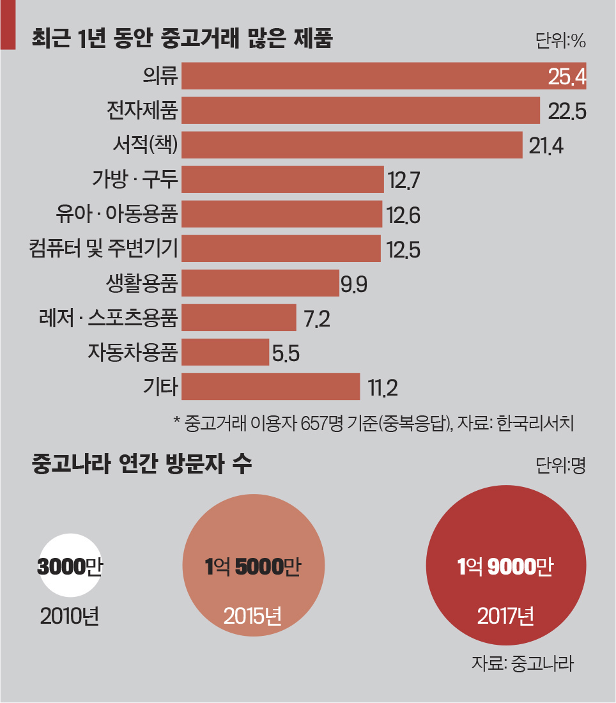

# be12-1st-5ven-bread_book
# ⏱프로젝트 개요
## 📽 팀명: 5ven
### 😃팀원소개

<figure>
    <table>
      <tr>
        <td align="center"></td>
        <td align="center"></td>
        <td align="center"></td>
	<td align="center"></td>
        <td align="center"></td>
      </tr>
      <tr>
        <td align="center">팀장: <a href="https://github.com/InukChoi">최인욱</a></td>
	<td align="center">팀장: <a href="https://github.com/daydeiday">곽효림</a></td>
        <td align="center">팀원: <a href="https://github.com/wkdlrn">김재구</a></td>
        <td align="center">팀원: <a href="https://github.com/ChangeunLim" >임찬근</a></td>
	<td align="center">팀원: <a href="https://github.com/choi-won-ik" >최원익</a></td>
      </tr>
    </table>
</figure>

## 📽프로젝트 소개
### 웹 서비스명: 책빵 📖🍞
### **중고서적 거래 플랫폼**

현대인들은 책을 통해 지식을 얻고 감동을 경험하지만 더 이상 필요하지 않은 책이 쌓여가는 문제를 자주 겪습니다. **중고서적 거래 플랫폼**은 개인과 개인(P2P) 또는 개인과 업자 간의 중고 책 거래를 손쉽게 연결하여 책의 가치를 지속적으로 나눌 수 있는 공간을 제공합니다.

### **프로젝트 목적**

- **지속 가능성**: 불필요한 책을 판매하거나 필요한 책을 저렴한 가격으로 구매할 수 있는 순환 경제 모델을 구축합니다.
- **접근성**: 남녀노소 누구나 간편하게 사용할 수 있는 직관적인 UI와 사용자 친화적 기능을 제공합니다.

### 시장 조사
***
| 기능 | 당근마켓 | 번개장터 | 알라딘 | 중고나라 | 영풍문고 | 교보문고 | 예스24 |
| --- | --- | --- | --- | --- | --- | --- | --- |
| **개인 간 중고거래** | O | O | X | O | X | X | X |
| **개인-업자 간 거래** | X | O | O | O | O | O | O |
| **지역 기반 직거래** | O | X | X | X | X | X | X |
| **택배 거래 지원** | X | O | O | O | O | O | O |
| **안전결제 시스템** | X | O | O | O | O | O | O |
| **책 카테고리 분류** | O | O | O | O | O | O | O |
| **판매자-구매자 채팅** | O | O | X | O | X | X | X |
| **신간 서적 판매** | X | X | O | X | O | O | O |
| **오프라인 매장 연계** | X | X | O | X | O | O | O |
| **소셜 로그인 지원** | O | O | O | O | O | O | O |
| **게시판 기능** | O | O | X | O | X | X | X |

***

### **주요 특징**

1. **사용자 맞춤 카테고리 분류**: 이용자 특성(연령대, 관심사 등)에 따라 책을 검색할 수 있습니다.
2. **신뢰 기반 거래 시스템**: 판매자-구매자 간 채팅 및 결제 기능을 통해 안전하고 원활한 거래를 보장합니다.
3. **간편한 사용성**: 책 등록 시 카테고리를 지정해 원하는 대상을 정확히 타겟팅할 수 있습니다.

***
### **차별점**

중고서적에 특화된 시스템을 통해 **책 거래에 최적화된 이용자의 특성별 카테고리화**와 **추천 시스템**을 제공합니다. 나아가, 중고 책뿐 아니라 희귀 서적과 신간 서적을 업자들과의 거래를 통해 구할 수 있는 기능도 탑재할 예정입니다.

# 배경

### 줄어드는 헌책방과 성장하는 중고거래 시장, 그리고 중고서점의 인기

국내 중고거래 시장은 최근 몇 년간 급격히 성장하고 있습니다. **2021년 약 24조 원 규모**를 기록한 데 이어, **2025년**에는 **43조 원을 돌파할 것**으로 전망됩니다. 이러한 성장은 모바일 애플리케이션의 도입과 함께 이루어졌습니다. 대표적으로 2011년에 출시된 번개장터와 2015년에 등장한 당근마켓은 사용자 친화적인 인터페이스와 지역 기반 거래 시스템으로 중고거래를 더욱 간편하게 만들었으며, 2022년 8월 기준 **중고거래 앱 설치자 수는 3,378만 명, 실제 사용자 수는 2,264만 명**으로 역대 최대치를 기록했습니다. [1]

이처럼 중고거래 시장이 활성화됨에 따라 중고 서적에 대한 관심도 높아지고 있습니다. 현재 3대 기업형 중고서점(알라딘, 예스24, 개똥이네)의 전국 매장 수는 80여 개에 이르며, 소비자들은 읽지 않는 책을 판매하거나 새 책과 거의 동일한 상태의 중고 서적을 저렴한 가격에 구매할 수 있는 점에서 매력을 느끼고 있습니다. 특히 자녀의 성장 단계에 따라 필요한 책이 달라지는 가정에서는 중고서점을 통해 경제적인 부담을 줄일 수 있어 이용자가 증가하는 추세입니다. 실제로 ‘2017년 국민 독서실태 조사’에 따르면, 중고서점을 주로 이용하는 성인의 비율은 2015년 2.4%에서 2017년 3.1%로, 초·중·고 학생의 비율은 같은 기간 3.4%에서 4.9%로 증가했습니다. [1]

### 중고서적 거래의 불편함과 전문 플랫폼의 필요성

최근 중고거래 시장은 특정 카테고리에 특화된 신생 플랫폼의 등장을 통해 더욱 세분화되고 있습니다. 예를 들어, 2023년 서비스를 시작한 ‘차란’은 중고 의류 판매 대행 서비스로 큰 성과를 거두었고, 2020년 출시된 ‘크림(KREAM)’은 미사용 중고 스니커즈 거래라는 차별화된 콘셉트로 빠르게 성장하고 있습니다. [2]

하지만, 가장 활발히 사용되는 중고거래 플랫폼인 당근마켓과 번개장터는 모든 물건을 포괄적으로 거래할 수 있다는 특징 때문에 **세부 분류가 다양한** 서적을 구매하거나 판매할 때 불편함이 존재합니다.  ****또한, 중고서적 전문 서비스인 알라딘 중고서점이나 인터넷 헌책방 역시 검색의 번거로움, 플랫폼 간 정보 분산, 한정된 재고 등의 문제가 있습니다.

이처럼 중고서적 거래량은 증가하고 있으나, 사용자 편의성을 충분히 만족시키는 전문 플랫폼이 부족한 상황입니다. 따라서, 중고서적 거래를 더욱 편리하게 하고 소비자의 니즈를 충족할 수 있는 혁신적인 플랫폼의 필요성이 더욱 커지고 있습니다.

# 시나리오

### 필요성

대학교들을 대상으로한 제휴 서비스들이나 대학생들만을 위한 교양책, 전공책등 중고 온라인 거래처 공간있지만 카테고리나 학교별 교양수업 등등 서적을 찾기가 어렵다.
*타임 또한내부 거래 플랫폼은 있지만 플랫폼 내부에서는 서적별 구분과 수업별 교재를 찾기 어렵다.
심지어는 중고 서적 거래 플랫폼이 있는 지도 모르는 경우도 다반사이며, 다른 중고 플랫폼을 이용하는 것이 대반수 이다.
거래 또한 당근, 번개등들처럼 사람이 직거래를 하거나, 택배거래를 해야하는 번거러움이 있다.
이를 해결 할 수 있는 중간 매게체가 되어 학교별, 다른 교양, 다른 전공별 카테고리의 중고 서적을 편하게 집에서 택배로 빠르게 받을 수 있는 서비스 사이트를 오픈한다.

### 판매자 시나리오

- 감명깊게 읽은 책을 그냥 버리긴 아까워 중고거래로 내놓기로 한다.
유명 중고서적 거래 사이트에 회원가입을 하고 내가 팔려고 했던 책을 찾아본다.
- 찾아보니 비슷한 책들의 가격을 알아서 알려주어 바로 적정가를 생각할 수 있다. 그에 따라 판매글을 카테고리에 맞춰 작성해보았다.
- 어떤 구매자가 관심을 갖게 되어 남긴 댓글을 보고 채팅을 걸어보았다. 어느정도 적정한 가격이라 생각했지만 조금 더 싸게 내놓는 대신 내 집 앞에서 거래 하기로 했다. 직거래로 거래를 하기로 해서 짚 앞에서 만나 결제를 진행했다.
- 깔끔하게 채팅하시고 거래해주신 것이 좋아서 내가 감명깊게 읽은 책을 그분도 풍성하게 읽었으면 하는 마음을 담아 구매자분에게 별점 5점 만점 주기 버튼을 눌렀다. 좋은 거래였다.

### 구매자 시나리오

- 회원가입은 내 email인증을 통하여 진행하거나, google 혹은 naver와 같은 계정과 연동하여 간편하게 회원가입을 할 수 있다.
- 필요한 서적을 검색기능을 활용하여 찾아본다. 알아본 서적 뿐만 아니라 카테고리를 통해 비슷한 종류의 서적들을 확인 할 수 있다.  조금 더 합리적인 소비를 하기 위해 가격순 그리고 판매자의 신용도 순으로 정렬하여 서적을 찾아 보았고, 마음에 드는 서적은 찜 목록에 담아둔다.
- 찜한 서적을 판매하는 사용자와 채팅하기 기능을 통해 연락하여 결제방법, 가격등을 협의할 수 있다.
- 결제 텝에선 먼저 직접 만나서 결제할 지, pay시스템을 사용하여 결제할 지 선택한다.
    - 판매자와 직접 만나 결제하기로 합의 했다. 서로 만나기를 원하는 장소를 카카오맵 통해 지정하였다.
    - 판매자와 pay 시스템 결제로 합의 했다. 택배비는 상품가격에 포함이라고 하여, 주소쓰는 란에 주소를 입력한 후 카카오페이를 통해 상품결제를 진행하였다.
- 서적의 구매를 완료하고, 만족스러운 리뷰를 작성하고 판매자에게 5점 만점의 별점을 주어 판매자의 신용등급이 올라간다.

## 💬요구사항 명세
➡[요구사항명세 바로가기](/pdf/요구사항 정의서.pdf)
## 📅WBS
➡[WBS 바로가기](/pdf/5ven ERD.png)

## 🔗Replication
### System Architecher

