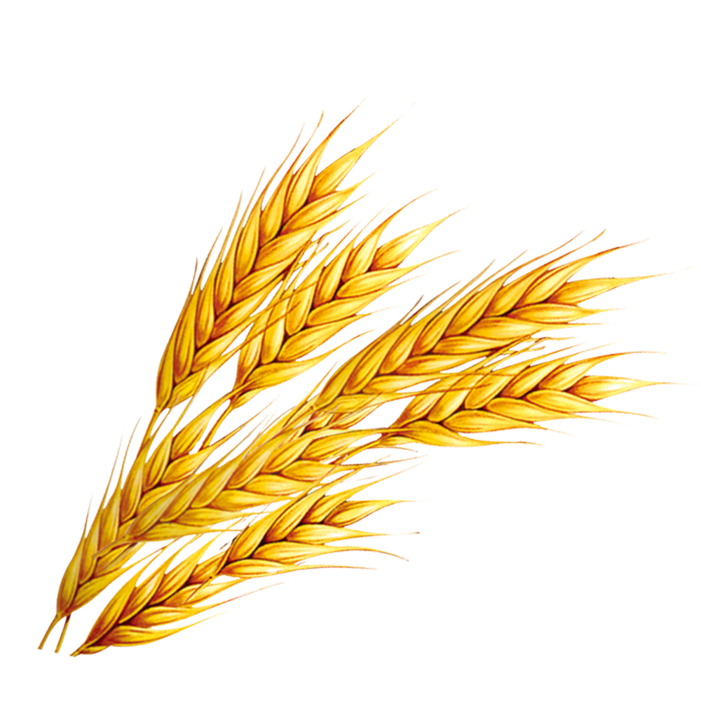

# 중고서적 거래 플랫폼 책빵 📖🍞 !
<p align="middle" style="margin: 0; padding: 0;">
  
</p>

<p align="middle">
[플레이 데이터] 한화시스템 BEYOND SW캠프
<br>🥪팀 5VEN
</p>

## 😃 팀원 소개

<figure>
    <table>
      <tr>
        <td align="center"></td>
        <td align="center"></td>
        <td align="center"></td>
	<td align="center"></td>
        <td align="center"></td>
      </tr>
      <tr>
        <td align="center">팀장: <a href="https://github.com/daydeiday">곽효림</a></td>
        <td align="center">팀원: <a href="https://github.com/wkdlrn">김재구</a></td>
        <td align="center">팀원: <a href="https://github.com/ChangeunLim" >임찬근</a></td>
        <td align="center">팀장: <a href="https://github.com/InukChoi">최인욱</a></td>
	<td align="center">팀원: <a href="https://github.com/choi-won-ik" >최원익</a></td>
      </tr>
    </table>
</figure>


## 📝 프로젝트 소개

> 현대인들은 책을 통해 지식을 얻고 감동을 경험하지만 더 이상 필요하지 않은 책이 쌓여가는 문제를 자주 겪습니다. **중고서적 거래 플랫폼**은 개인과 개인(P2P) 또는 개인과 업자 간의 중고 책 거래를 손쉽게 연결하여 책의 가치를 지속적으로 나눌 수 있는 공간을 제공합니다.


## 🎮 기술 스택
&nbsp;&nbsp;&nbsp;&nbsp;</a>
&nbsp;&nbsp;&nbsp;&nbsp;</a>
&nbsp;&nbsp;&nbsp;&nbsp;</a>
&nbsp;&nbsp;&nbsp;&nbsp;</a>
&nbsp;&nbsp;&nbsp;&nbsp;</a>
<br>


## 📂 요구사항 정의서 
[요구사항 정의서](https://github.com/beyond-sw-camp/be12-1st-5ven-bread_book/blob/kjg/assets/5%EC%A1%B0_%EC%9A%94%EA%B5%AC%EC%82%AC%ED%95%AD%20%EC%A0%95%EC%9D%98%EC%84%9C.pdf)

<br>

## ⚙️ ERD

<br>

## 🔀 시스템 아키텍처

<br>

## 🔎 SQL 파일 및 성능 개선
### SQL 파일
<details>
<summary>MEMBER</summary>
<div markdown="1">

- [member.sql](./assets/image/member.sql)

</div>
</details>

<details>
<summary>CHAT</summary>
<div markdown="1">

- [chat.sql](./assets/image/chat.sql)

</div>
</details>


<details>
<summary>PRODUCT</summary>
<div markdown="1">

- [product.sql](./assets/image/product.sql)

</div>
</details>


<details>
<summary>PAY</summary>
<div markdown="1">

- [pay.sql](./assets/image/pay.sql)

</div>
</details>


### SQL 성능 개선

```sql
-- 채팅방 조회(개선전) ----
SELECT 
    cr.id AS chat_room_id,       -- 채팅방 ID
    cr.identifier AS book_title, -- 책 제목
    b.id AS book_id,             -- 책 ID
    p.id AS product_id,          -- 판매 게시글 ID
    p.member_id AS seller_id,    -- 판매자 ID
    cr.last_chat,                -- 마지막 메시지
    cr.created_at                -- 생성일시
FROM chatting_room cr
JOIN product p ON cr.identifier = (
    SELECT b.title               -- 책 제목과 identifier 매칭
    FROM book b 
    WHERE b.id = p.book_id
)
JOIN book b ON b.id = p.book_id  -- 책 ID를 추가로 가져오기 위해 조인
LIMIT 0, 1000;

-- 채팅방 조회(개선후) ----
SELECT 
    cr.id AS chat_room_id,       -- 채팅방 ID
    b.title AS book_title,       -- 책 제목 (JOIN에서 가져옴)
    b.id AS book_id,             -- 책 ID
    p.id AS product_id,          -- 판매 게시글 ID
    p.member_id AS seller_id,    -- 판매자 ID
    cr.last_chat,                -- 마지막 메시지
    cr.created_at                -- 생성일시
FROM chatting_room cr
JOIN book b ON cr.identifier = b.title  -- identifier와 title 매칭
JOIN product p ON b.id = p.book_id  -- 책 ID를 가져오기 위한 조인
LIMIT 1000; -- LIMIT 범위 적용
```

<br>
